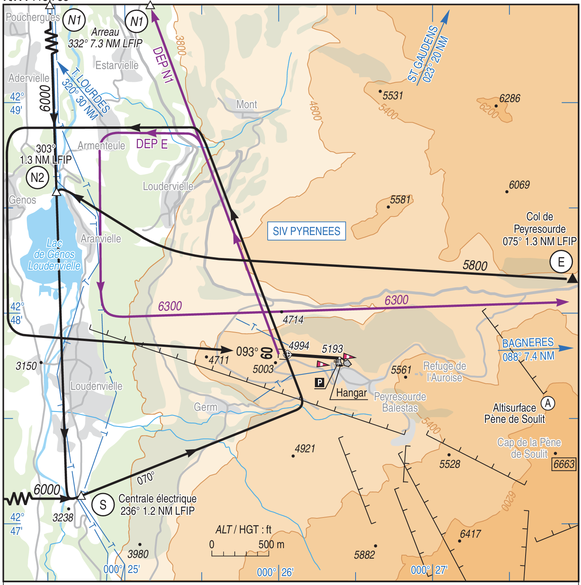

= Altiport de Peyresourde
ifndef::full[]
Jean-Michel Bruel -- Référent Espaces Aériens CDVL11 
include::definitions.adoc[]
endif::[]

== La règle

Comme tous les altiports, les procédures d'approche et de départ sont décrites dans une carte d'approche publiée par la DGAC. 
Pour Peyresourde (enfin Peyresourde-Balestas, code LFIP) il s'agit de la carte {VAC}  https://www.peyragudes-air-club.fr/medias/files/vac-lfip-20231102.pdf[carte VAC LFIP] publiée en novembre 2023, qui décrit les procédures d'approche et de départ pour les avions et les hélicoptères :

[[carteVAC]]
.Approche à vue de Peyresourde (Carte complète https://www.peyragudes-air-club.fr/medias/files/vac-lfip-20231102.pdf[ici])

== Cohabitation parapente et altiport

Un protocole de coactivité a été mis à jour après une situation problématique en août 2024 :

.Coactivité à Peyresourde
image::SurvolAltiportPeyragudes.jpg[Coactivité à Peyresourde, 95%, alt="Coactivité à Peyresourde"]

WARNING: Cette coactivité ne montre pas l'altitude de rentrée des aéronefs vers l'altiport, qui est de 6000 ft (environ 1820 m) comme indiqué sur la <<carteVAC, carte VAC>>.

.La fiche de la FAA (source Fiches Icarus FFA: https://www.ffa-aero.fr/WD170AWP/WD170Awp.exe/CONNECT/SITEFFAPROD?_WWREFERER_=https%3A%2F%2Fwww.ffa-aero.fr%2FWD170AWP%2FWD170Awp.exe%2FCONNECT%2FSITEFFAPROD&_WWNATION_=5&_WW1STPAGE_=frm_icarus[ici])
image::FAA.png[Fiche de la FAA, 95%, alt="Fiche de la FAA"]

//======================== Annexes pour la version Tuchan seul ========================
ifndef::full[]

:numbered!:
[appendix]
include::acronymes.adoc[leveloffset=+1]

endif::[]
